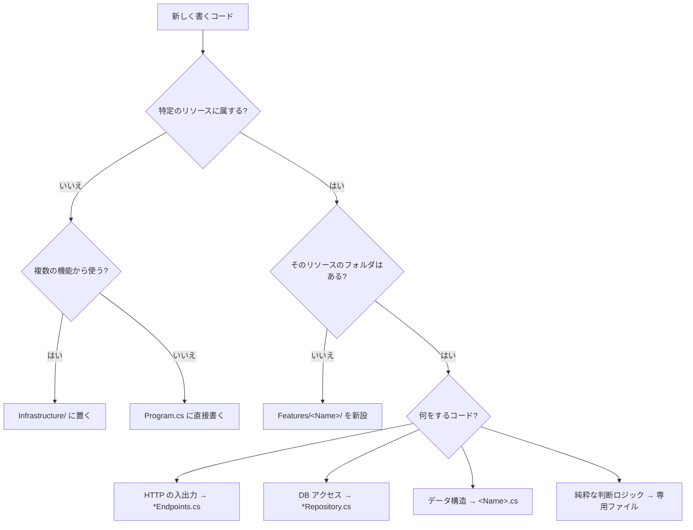
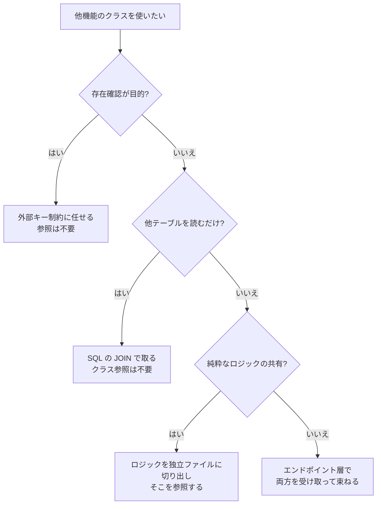

# バックエンドアーキテクチャ

## 依存の向き

```PlainText
Program.cs
   ↓
Features/Projects/ProjectEndpoints
   ↓
Features/Projects/ProjectRepository
   ↓
Infrastructure/SqlConnectionFactory
   ↓
Microsoft.Data.SqlClient
```

> [!NOTE] 横方向の依存について
>
> 機能が増えたとき、`Features/Entries/EntryRepository` が `Features/Projects/ProjectRepository` を参照したくなる場面が出てくる（「記録を保存する前にプロジェクトの存在を確認する」ような処理）
>
> → 外部キー制約に任せる

## 新機能を実装するときの判断チャート

### 1. 書いたコードをどこに置くか



### 2. 他の機能を参照したくなったとき



## ファイルの分類指針

| ファイル | 置くもの | 置かないもの |
| --- | --- | --- |
| `*Endpoints.cs` | ルート登録、HTTP ステータスの決定、複数リポジトリの結果の組み立て | SQL、業務ルール |
| `*Repository.cs` | SQL、Dapper の呼び出し、行→オブジェクトの変換 | HTTP に関する判断、業務ルール |
| `<Name>.cs` | DB の行に対応する record | メソッド、ロジック |
| `<Rule>.cs`（例: `StatusTransition.cs`） | DB にも HTTP にも触れない純粋な判断 | 接続、リポジトリの参照 |
| `Infrastructure/` | どの機能にも属さない横断的な部品 | 特定リソースの処理 |

## 新しいエンドポイントを足す手順

1. **SQL を先に書く**

    MSSQL 拡張で実行し、期待する行が返ることを確認してから C# に移す
2. **必要ならレスポンス用の record を作る**

    DB の行と形が違うときだけ。同じなら既存の record を使い回す
3. **リポジトリにメソッドを足す**

    命名は `Async` で終える（`.editorconfig` の命名規則）
4. **エンドポイントを登録する**

    `MapGroup` 配下に追加し、ハンドラは独立したメソッドにする
5. **戻り値の型を確認する**

    単数か複数か / 404 があり得るか
6. **`npm run gen:api` を実行**

    OpenAPI とフロントの型を再生成し、差分を確認する

### 戻り値の型の決め方

| 状況 | 型 |
| --- | --- |
| 一覧を返す（0件もあり得る） | `Ok<IReadOnlyList<T>>` |
| 単一を返す（存在しないことがある） | `Results<Ok<T>, NotFound>` |
| 作成・更新 | `Results<Ok<T>, BadRequest<...>, NotFound>` |
| 削除 | `Results<NoContent, NotFound>` |
