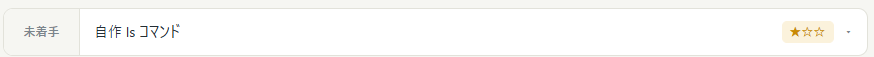
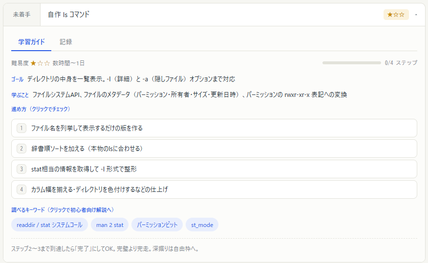

# Storybookのチュートリアル

## React 向けの Storybook を構築する

- [React 向け Storybook のチュートリアル](https://storybook.js.org/tutorials/intro-to-storybook/react/ja/get-started/)

既存プロジェクトのルートディレクトリ（今回は `web/`）で以下のコマンドを実行する

利用中のビルドツール（Vite, Next.js, Webpackなど）が自動判別され、必要な設定ファイルと依存パッケージがインストールされる

```bash
npm storybook@latest init
```

npm scriptに `storybook` が追加されるため、それを実行して、動作確認

```bash
npm run storybook
```

## 単純なコンポーネントを作る

- [Build a simple component](https://storybook.js.org/tutorials/intro-to-storybook/react/en/simple-component/)

CDD（Component Driven Development：コンポーネント駆動開発）手法に沿って、UIを構築していく

CDDは最小単位のコンポーネントから始めて最終的に画面全体をくみ上げていく**ボトムアップ**のアプローチ

### Project コンポーネント

- 課題の状態 (`state`) に応じて表示が変化する
- 課題の表示状態（開 / 閉）のボタン
- 課題名

必要な Props は以下

- `title`: 課題の内容を表す文字列
- `state`: 課題が現在、「未完了」「進行中」「完了」かどうかを示すステータス

`Task` の実装を始めるにあたって、上記の項目に対応する**テスト用の状態 (Story) を定義する**

その後、Storybookを使用してモックデータとともにコンポーネントを単体で作成し、各状態での見た目を「ビジュアルテスト」しながら進める




### セットアップ

`src/components/Task.tsx` と `src/components/Task.stories.tsx` を作成する

```tsx
type ProjectData = {
  id: string;
  title: string;
  state: 'TODO' | 'DOING' | 'DONE';
  difficulty: number;
};

type ProjectProps = {
  project: ProjectData;
  isOpen: boolean;
  onChangeState: (id: string) => void;
  onSwitchProject: (id: string) => void;
};

export default function Project({
  project: { id, title, state, difficulty },
  isOpen,
  onChangeState
}: ProjectProps) {
  return (
    <div className="flex items-stretch overflow-hidden rounded-[1px] border-[#E2E2DA] border-solid bg-white">
      <button className="bg-[#F6F6F2] text-[#7B858C] cursor-pointer">未着手</button>
      <button className="bg-[#232E36] cursor-pointer flex items-center flex-1 gap-2.5 px-3 py-3.5 text-sm text-left">
        <span>{title}</span>
        <span className="flex gap-1.5 ml-auto flex-wrap">
          <span className="text-[#C98A04] border border-solid rounded-[5px] px-px py-1.75 text-[11px] font-[ui-monospace,monospace] border-[#FBF2DC] bg-[#FBF2DC] tracking-[1px]">{difficulty}</span>
        </span>
        <span className="text-[#7B858C] text-[11px] [transition:transform,0.15s,ease]" aria-hidden={true}>▾</span>
      </button>
    </div>
  )
}
```

ストーリーファイルに `Project` の3つのテスト用状態を定義する

```tsx:Project.stories.tsx
import Project from "@/components/Project";
import type { Meta, StoryObj } from "@storybook/react-vite";
import { fn } from "storybook/test";

export const ActionsData = {
  onChangeState: fn(),
  onSwitchAccordion: fn(),
};

const meta = {
  component: Project,
  title: 'Project',
  tags: ['autodocs'],
  excludeStories: /.*Data$/,
  args: {
    ...ActionsData
  },
} satisfies Meta<typeof Project>;

export default meta;
type Story = StoryObj<typeof meta>;

export const Default: Story = {
  args: {
    project: {
      id: '1',
      title: '自作 ls コマンド',
      state: 'TODO',
      difficulty: 1,
    },
    isOpen: false
  }
}

export const Doing: Story = {
  args: {
    project: {
      ...Default.args.project,
      state: 'DOING'
    },
    isOpen: false
  }
}

export const Done: Story = {
  args: {
    project: {
      ...Default.args.project,
      state: 'DONE'
    },
    isOpen: false
  }
}
```

### 原型に使われているCSSを再現するTailwind CSS

- [Tailwind CSS 日本語チートシート](https://telehakke.github.io/tailwindcss-japanese-cheat-sheet/)

#### `items-stretch` (`align-items: stretch`)

アイテムの整列を行い、**隙間を埋めるように子要素を引き延ばす**

#### 任意の色を使用する

クラス名の後ろに `[...]` を付けてカラーコードを直接渡せる

```tsx
<button className="bg-[#F6F6F2] text-[#7B858C]"></button>
<button className="bg-[#232E36]">{title}</button>
```

`px` や `vw` を指定する場合も同様

```tsx
<div className="flex items-stretch overflow-hidden rounded-[1px]">
  <button className="bg-[#F6F6F2] text-[#7B858C]"></button>
  <button className="bg-[#232E36]">{title}</button>
</div>
```

## 行の見出しをコンポーネントとして切り出す

`車輪の再発明トラッカー.jsx` は**グローバルな状態を直接読んでいる**

コンポーネントに分けるときの要点は、これらを **props に置き換えて外に依存しない形にする**

### 状態毎のラベルと色の変化

| `state` | ラベル | 背景色 | 文字色 |
| --- | --- | --- | --- |
| **`TODO`** | 未着手 | `#F6F6F2` | `#7B858C` |
| **`DOING`** | 進行中 | `#FBF2DC` | `#C98A04` |
| **`DONE`** | 完了 | `#E8EEFD` | `#2B5CE6` |

#### `Record<Keys, Type>`

プロパティのキーが `Keys` であり、プロパティの値が `Type` であるオブジェクトの型を作る

```ts
type StringNumber = Record<string, number>;
const value: StringNumber = { a: 1, b: 2, c: 3 };
```

## Playwright用の実ブラウザがダウンロードされていないエラー

作業を終えて、リモートにpushしたら、Lefthookの `pre-push` フックによる `verify-push.mjs` が実行する `vitest run` で発生

<details>
  <summary>エラー本文（クリックして開く）</summary>

  ```PlainText
  ⎯⎯⎯⎯⎯⎯ Unhandled Error ⎯⎯⎯⎯⎯⎯⎯
  ╭────────────────────────────────────────╮
  │ 🥊 lefthook  v2.1.12   hook:  pre-push │
  ╰────────────────────────────────────────╯
  ⠧ waiting: verify-pushed-commits⎯⎯⎯⎯⎯⎯ Unhandled Errors ⎯⎯⎯⎯⎯⎯

  Vitest caught 1 unhandled error during the test run.
  This might cause false positive tests. Resolve unhandled errors to make sure your tests are not affected.

  ⎯⎯⎯⎯⎯⎯ Unhandled Error ⎯⎯⎯⎯⎯⎯⎯
  Error: browserType.launch: Executable doesn't exist at  C:\Users\miyashita\AppData\Local\ms-playwright\chromium_headless_shell-1243\chrome-headle  ss-shell-win64\chrome-headless-shell.exe
  ╔════════════════════════════════════════════════════════════╗
  ║ Looks like Playwright was just installed or updated.       ║
  ║ Please run the following command to download new browsers: ║
  ║                                                            ║
  ║     npx playwright install                                 ║
  ║                                                            ║
  ║ <3 Playwright Team                                         ║
  ╚════════════════════════════════════════════════════════════╝
   ❯ node_modules/@vitest/browser-playwright/dist/index.js:941:55
   ❯ PlaywrightBrowserProvider.createContext node_modules/@vitest/browser-playwright/dist/ index.js:1077:19
   ❯ PlaywrightBrowserProvider.openBrowserPage node_modules/@vitest/browser-playwright/  dist/index.js:1147:19
   ❯ PlaywrightBrowserProvider.openPage node_modules/@vitest/browser-playwright/dist/index.  js:1161:23
   ❯ TestProject._openBrowserPage node_modules/vitest/dist/chunks/cli-api.CnMVyzaz.  js:11040:3
   ❯ BrowserPool.openPage node_modules/vitest/dist/chunks/cli-api.CnMVyzaz.js:2578:3
   ❯ BrowserPool.runTests node_modules/vitest/dist/chunks/cli-api.CnMVyzaz.js:2573:3
   ❯ runWorkspaceTests node_modules/vitest/dist/chunks/cli-api.CnMVyzaz.js:2473:3
   ❯ executeTests node_modules/vitest/dist/chunks/cli-api.CnMVyzaz.js:3779:25
   ❯ node_modules/vitest/dist/chunks/cli-api.CnMVyzaz.js:13657:7
   ❯ node_modules/vitest/dist/chunks/cli-api.CnMVyzaz.js:13684:11
   ❯ node_modules/vitest/dist/chunks/cli-api.CnMVyzaz.js:13546:19
   ❯ startVitest node_modules/vitest/dist/chunks/cli-api.CnMVyzaz.js:14621:8
   ❯ start node_modules/vitest/dist/chunks/cac.uFydS1Z4.js:2340:15
   ❯ CAC.run node_modules/vitest/dist/chunks/cac.uFydS1Z4.js:2318:2

  ⎯⎯⎯⎯⎯⎯⎯⎯⎯⎯⎯⎯⎯⎯⎯⎯⎯⎯⎯⎯⎯⎯⎯⎯⎯⎯⎯⎯⎯⎯
  Serialized Error: { log: [] }
  ⎯⎯⎯⎯⎯⎯⎯⎯⎯⎯⎯⎯⎯⎯⎯⎯⎯⎯⎯⎯⎯⎯⎯⎯⎯⎯⎯⎯⎯⎯

  error during close browserType.launch: Executable doesn't exist at  C:\Users\miyashita\AppData\Local\ms-playwright\chromium_headless_shell-1243\chrome-headle  ss-shell-win64\chrome-headless-shell.exe
  ╔════════════════════════════════════════════════════════════╗
  ║ Looks like Playwright was just installed or updated.       ║
  ║ Please run the following command to download new browsers: ║
  ║                                                            ║
  ║     npx playwright install                                 ║
  ║                                                            ║
  ║ <3 Playwright Team                                         ║
  ╚════════════════════════════════════════════════════════════╝
      at  C:\Users\miyashita\projects\rota-tracker\web\node_modules\@vitest\browser-playwright\  dist\index.js:941:55
      at PlaywrightBrowserProvider.createContext  (C:\Users\miyashita\projects\rota-tracker\web\node_modules\@vitest\browser-playwright  \dist\index.js:1077:19)
      at PlaywrightBrowserProvider.openBrowserPage  (C:\Users\miyashita\projects\rota-tracker\web\node_modules\@vitest\browser-playwright  \dist\index.js:1147:19)
      at PlaywrightBrowserProvider.openPage   (C:\Users\miyashita\projects\rota-tracker\web\node_modules\@vitest\browser-playwright \dist\index.js:1161:23)
      at TestProject._openBrowserPage   (C:\Users\miyashita\projects\rota-tracker\web\node_modules\vitest\dist\chunks\cli-api .CnMVyzaz.js:11040:3)
      at BrowserPool.openPage   (C:\Users\miyashita\projects\rota-tracker\web\node_modules\vitest\dist\chunks\cli-api .CnMVyzaz.js:2578:3)
      at BrowserPool.runTests   (C:\Users\miyashita\projects\rota-tracker\web\node_modules\vitest\dist\chunks\cli-api .CnMVyzaz.js:2573:3)
      at runWorkspaceTests  (C:\Users\miyashita\projects\rota-tracker\web\node_modules\vitest\dist\chunks\cli-api  .CnMVyzaz.js:2473:3)
      at executeTests   (C:\Users\miyashita\projects\rota-tracker\web\node_modules\vitest\dist\chunks\cli-api .CnMVyzaz.js:3779:25)
      at  C:\Users\miyashita\projects\rota-tracker\web\node_modules\vitest\dist\chunks\cli-api.  CnMVyzaz.js:13657:7
      at  C:\Users\miyashita\projects\rota-tracker\web\node_modules\vitest\dist\chunks\cli-api.  CnMVyzaz.js:13684:11
      at  C:\Users\miyashita\projects\rota-tracker\web\node_modules\vitest\dist\chunks\cli-api.  CnMVyzaz.js:13546:19
      at startVitest  (C:\Users\miyashita\projects\rota-tracker\web\node_modules\vitest\dist\chunks\cli-api  .CnMVyzaz.js:14621:8)
      at start  (C:\Users\miyashita\projects\rota-tracker\web\node_modules\vitest\dist\chunks\cac. uFydS1Z4.js:2340:15)
      at CAC.run  (C:\Users\miyashita\projects\rota-tracker\web\node_modules\vitest\dist\chunks\cac. uFydS1Z4.js:2318:2) {
    log: [],
    name: 'Error',
    type: 'Unhandled Error',
    stacks: [
      {
        method: '',
        file: 'C:/Users/miyashita/projects/rota-tracker/web/node_modules/@vitest/ browser-playwright/dist/index.js',
        line: 941,
        column: 55
      },
      {
        method: 'PlaywrightBrowserProvider.createContext',
        file: 'C:/Users/miyashita/projects/rota-tracker/web/node_modules/@vitest/ browser-playwright/dist/index.js',
        line: 1077,
        column: 19
      },
      {
        method: 'PlaywrightBrowserProvider.openBrowserPage',
        file: 'C:/Users/miyashita/projects/rota-tracker/web/node_modules/@vitest/ browser-playwright/dist/index.js',
        line: 1147,
        column: 19
      },
      {
        method: 'PlaywrightBrowserProvider.openPage',
        file: 'C:/Users/miyashita/projects/rota-tracker/web/node_modules/@vitest/ browser-playwright/dist/index.js',
        line: 1161,
        column: 23
      },
      {
        method: 'TestProject._openBrowserPage',
        file: 'C:/Users/miyashita/projects/rota-tracker/web/node_modules/vitest/dist/ chunks/cli-api.CnMVyzaz.js',
        line: 11040,
        column: 3
      },
      {
        method: 'BrowserPool.openPage',
        file: 'C:/Users/miyashita/projects/rota-tracker/web/node_modules/vitest/dist/ chunks/cli-api.CnMVyzaz.js',
        line: 2578,
        column: 3
      },
      {
        method: 'BrowserPool.runTests',
        file: 'C:/Users/miyashita/projects/rota-tracker/web/node_modules/vitest/dist/ chunks/cli-api.CnMVyzaz.js',
        line: 2573,
        column: 3
      },
      {
        method: 'runWorkspaceTests',
        file: 'C:/Users/miyashita/projects/rota-tracker/web/node_modules/vitest/dist/ chunks/cli-api.CnMVyzaz.js',
        line: 2473,
        column: 3
      },
      {
        method: 'executeTests',
        file: 'C:/Users/miyashita/projects/rota-tracker/web/node_modules/vitest/dist/ chunks/cli-api.CnMVyzaz.js',
        line: 3779,
        column: 25
      },
      {
        method: '',
        file: 'C:/Users/miyashita/projects/rota-tracker/web/node_modules/vitest/dist/ chunks/cli-api.CnMVyzaz.js',
        line: 13657,
        column: 7
      },
      {
        method: '',
        file: 'C:/Users/miyashita/projects/rota-tracker/web/node_modules/vitest/dist/ chunks/cli-api.CnMVyzaz.js',
        line: 13684,
        column: 11
      },
      {
        method: '',
        file: 'C:/Users/miyashita/projects/rota-tracker/web/node_modules/vitest/dist/ chunks/cli-api.CnMVyzaz.js',
        line: 13546,
        column: 19
      },
      {
        method: 'startVitest',
        file: 'C:/Users/miyashita/projects/rota-tracker/web/node_modules/vitest/dist/ chunks/cli-api.CnMVyzaz.js',
        line: 14621,
        column: 8
      },
      {
        method: 'start',
        file: 'C:/Users/miyashita/projects/rota-tracker/web/node_modules/vitest/dist/ chunks/cac.uFydS1Z4.js',
        line: 2340,
        column: 15
      },
      {
        method: 'CAC.run',
        file: 'C:/Users/miyashita/projects/rota-tracker/web/node_modules/vitest/dist/ chunks/cac.uFydS1Z4.js',
        line: 2318,
        column: 2
      }
    ]
  }
  ⠏ waiting: verify-pushed-commits✖ web-test failed
  ┃  verify-pushed-commits ❯       
  Verifying 211405c in the working tree (clean)

  ▶ web-typecheck

  > web@0.0.0 typecheck
  > tsc -b


  ▶ web-test

  > web@0.0.0 test
  > vitest run --passWithNoTests


   RUN  v4.1.11 C:/Users/miyashita/projects/rota-tracker/web


   Test Files   (1)
        Tests  no tests
       Errors  1 error
     Start at  11:28:53
     Duration  708ms (transform 0ms, setup 0ms, import 0ms, tests 0ms, environment 0ms)


  ▶ api-test
    復元対象のプロジェクトを決定しています...
    復元対象のすべてのプロジェクトは最新です。
  C:\Users\miyashita\projects\rota-tracker\api\WheelTracker.  Api\Features\Projects\ProjectEndPoints.cs(5,21): warning CS1591: 公開されている型またはメン バー 'ProjectEndpoints' の XML コメントがありません  [C:\Users\miyashita\projects\rota-tracker\api\WheelTracker.Api\WheelTracker.Api.csproj]
  C:\Users\miyashita\projects\rota-tracker\api\WheelTracker.  Api\Features\Projects\ProjectEndPoints.cs(7,24): warning CS1591: 公開されている型またはメン バー 'ProjectEndpoints.RegisterProjectItemsEndPoints(WebApplication)' の XML コメントがあ  りません [C:\Users\miyashita\projects\rota-tracker\api\WheelTracker.Api\WheelTracker.Api. csproj]
    WheelTracker.Api -> C:\Users\miyashita\projects\rota-tracker\api\WheelTracker.  Api\bin\Debug\net10.0\WheelTracker.Api.dll

    GenerateOpenApiDocuments:
      dotnet "C:\Users\miyashita\.nuget\packages\microsoft.extensions.apidescription. server\10.0.11\build\../tools/dotnet-getdocument.dll" --assembly   "C:\Users\miyashita\projects\rota-tracker\api\WheelTracker.Api\bin\Debug\net10. 0\WheelTracker.Api.dll" --file-list "obj\WheelTracker.Api.OpenApiFiles.cache"  --framework ".NETCoreApp,Version=v10.0" --output   "C:\Users\miyashita\projects\rota-tracker\api\WheelTracker.Api\OpenAPISchema"   --project "WheelTracker.Api" --assets-file  "C:\Users\miyashita\projects\rota-tracker\api\WheelTracker.Api\obj\project.assets. json" --platform "AnyCPU" 
    Generating document named 'v1'.
    Using discovered `GenerateAsync` overload with version parameter.
    Writing document named 'v1' to  'C:\Users\miyashita\projects\rota-tracker\api\WheelTracker.  Api\OpenAPISchema\WheelTracker.Api.json'.
    WheelTracker.Tests -> C:\Users\miyashita\projects\rota-tracker\api\WheelTracker.  Tests\bin\Debug\net10.0\WheelTracker.Tests.dll
  C:\Users\miyashita\projects\rota-tracker\api\WheelTracker.Tests\bin\Debug\net10.  0\WheelTracker.Tests.dll (.NETCoreApp,Version=v10.0) のテスト実行
  合計 1 個のテスト ファイルが指定されたパターンと一致しました。

  成功!   -失敗:     0、合格:     3、スキップ:     0、合計:     3、期間: 685 ms -   WheelTracker.Tests.dll (net10.0)

  exit status 1
    ────────────────────────────────────
  summary: (done in 16.85 seconds)
  🥊 verify-pushed-commits (15.45 seconds)
  error: failed to push some refs to 'https://github.com/ipon1207/rota-tracker.git'
  ```

</details>

### 原因

`@storybook/addon-vitest` が `vite.config.ts` にブラウザモードのテストプロジェクトを追加したため、Storyがテストとして**実ブラウザ (Chromium)** で動くようになった

| 段階 | 状態 |
| --- | --- |
| npmパッケージ `playwright` | インストール済み |
| ブラウザのバイナリ | 未ダウンロード |

Playwrightは実ブラウザを `node_modules` に配置せず、`%LOCALAPDATA%\ms-playwright\` にバージョンごとに別途ダウンロードする

→ `npm install` が終わっても、`chromium_headless_shell-1243` は存在しないことになる

### 対処

```bash
cd web
npx playwright install chromium
```

`npx playwright install` でも直すことができるが、Vitestで利用するブラウザがChromiumだけであれば上記で十分

## `verify-push.mjs` とViteのセキュリティ機能の衝突エラー

<details>
  <summary>エラー本文（クリックして開く）</summary>

  ```PlainText
  > git push origin 53-spike-storybookのチュートリアル
  ╭────────────────────────────────────────╮
  │ 🥊 lefthook  v2.1.12   hook:  pre-push │
  ╰────────────────────────────────────────╯
  ⠦ waiting: verify-pushed-commitsThe request id  "C:\Users\miyashita\projects\rota-tracker\web\node_modules\@storybook\addon-vitest\dist\v  itest-plugin\setup-file.js" is outside of Vite serving allow list.

  - C:/Users/miyashita/AppData/Local/Temp/verify-push-v289bD/repo/web
  - C:/Users/miyashita/AppData/Local/Temp/verify-push-v289bD/repo/web
  - C:/Users/miyashita/projects/rota-tracker/web/node_modules/vitest
  - C:/Users/miyashita/projects/rota-tracker/web/node_modules/@vitest/browser/dist
  - C:/Users/miyashita/projects/rota-tracker/web/node_modules/vite/dist/client
  - C:/Users/miyashita/projects/rota-tracker/web/node_modules/@vitest/browser-playwright/ dist/locators.js

  Refer to docs https://vite.dev/config/server-options.html#server-fs-allow for   configurations and more details.


  ⎯⎯⎯⎯⎯⎯ Failed Suites 1 ⎯⎯⎯⎯⎯⎯⎯

   FAIL   storybook (chromium)  src/components/Project.stories.tsx [ src/components/  Project.stories.tsx ]
  Error: Failed to import test file C:/Users/miyashita/projects/rota-tracker/web/ node_modules/@storybook/addon-vitest/dist/vitest-plugin/setup-file.js
  Caused by: TypeError: Failed to fetch dynamically imported module: http://  localhost:63315/@fs/C:/Users/miyashita/projects/rota-tracker/web/node_modules/@storybook/ addon-vitest/dist/vitest-plugin/setup-file.js?import&browserv=1791427346935
  ⎯⎯⎯⎯⎯⎯⎯⎯⎯⎯⎯⎯⎯⎯⎯⎯⎯⎯⎯⎯⎯⎯⎯⎯[1/1]⎯

  ⠇ waiting: verify-pushed-commits✖ web-test failed
  ┃  verify-pushed-commits ❯       
  Verifying 211405c in a temporary worktree:  C:\Users\miyashita\AppData\Local\Temp\verify-push-v289bD\repo

  ▶ web-typecheck

  > web@0.0.0 typecheck
  > tsc -b


  ▶ web-test

  > web@0.0.0 test
  > vitest run --passWithNoTests

  │
  ●  Storybook collects completely anonymous usage telemetry. We use it to
  │  shape Storybook's roadmap and prioritize features. You can learn more,
  │  including how to opt out, at https://storybook.js.org/telemetry

   RUN  v4.1.11 C:/Users/miyashita/AppData/Local/Temp/verify-push-v289bD/repo/web

   ❯  storybook (chromium)  src/components/Project.stories.tsx (0 test)

   Test Files  1 failed (1)
        Tests  no tests
     Start at  11:42:25
     Duration  1.53s (transform 0ms, setup 0ms, import 0ms, tests 0ms, environment 0ms)


  ▶ api-test
    復元対象のプロジェクトを決定しています...
    C:\Users\miyashita\AppData\Local\Temp\verify-push-v289bD\repo\api\WheelTracker. Tests\WheelTracker.Tests.csproj を復元しました (953 ミリ秒)。
    C:\Users\miyashita\AppData\Local\Temp\verify-push-v289bD\repo\api\WheelTracker. Api\WheelTracker.Api.csproj を復元しました (953 ミリ秒)。
  C:\Users\miyashita\AppData\Local\Temp\verify-push-v289bD\repo\api\WheelTracker. Api\Features\Projects\ProjectEndPoints.cs(5,21): warning CS1591: 公開されている型またはメン  バー 'ProjectEndpoints' の XML コメントがありません   [C:\Users\miyashita\AppData\Local\Temp\verify-push-v289bD\repo\api\WheelTracker.  Api\WheelTracker.Api.csproj]
  C:\Users\miyashita\AppData\Local\Temp\verify-push-v289bD\repo\api\WheelTracker. Api\Features\Projects\ProjectEndPoints.cs(7,24): warning CS1591: 公開されている型またはメン  バー 'ProjectEndpoints.RegisterProjectItemsEndPoints(WebApplication)' の XML コメントがあ りません [C:\Users\miyashita\AppData\Local\Temp\verify-push-v289bD\repo\api\WheelTracker.  Api\WheelTracker.Api.csproj]
    WheelTracker.Api ->   C:\Users\miyashita\AppData\Local\Temp\verify-push-v289bD\repo\api\WheelTracker. Api\bin\Debug\net10.0\WheelTracker.Api.dll

    GenerateOpenApiDocuments:
      dotnet "C:\Users\miyashita\.nuget\packages\microsoft.extensions.apidescription. server\10.0.11\build\../tools/dotnet-getdocument.dll" --assembly   "C:\Users\miyashita\AppData\Local\Temp\verify-push-v289bD\repo\api\WheelTracker.  Api\bin\Debug\net10.0\WheelTracker.Api.dll" --file-list "obj\WheelTracker.Api.  OpenApiFiles.cache" --framework ".NETCoreApp,Version=v10.0" --output  "C:\Users\miyashita\AppData\Local\Temp\verify-push-v289bD\repo\api\WheelTracker. Api\OpenAPISchema" --project "WheelTracker.Api" --assets-file  "C:\Users\miyashita\AppData\Local\Temp\verify-push-v289bD\repo\api\WheelTracker. Api\obj\project.assets.json" --platform "AnyCPU" 
    Generating document named 'v1'.
    Using discovered `GenerateAsync` overload with version parameter.
    Writing document named 'v1' to  'C:\Users\miyashita\AppData\Local\Temp\verify-push-v289bD\repo\api\WheelTracker. Api\OpenAPISchema\WheelTracker.Api.json'.
    WheelTracker.Tests ->   C:\Users\miyashita\AppData\Local\Temp\verify-push-v289bD\repo\api\WheelTracker. Tests\bin\Debug\net10.0\WheelTracker.Tests.dll
  C:\Users\miyashita\AppData\Local\Temp\verify-push-v289bD\repo\api\WheelTracker. Tests\bin\Debug\net10.0\WheelTracker.Tests.dll (.NETCoreApp,Version=v10.0) のテスト実行
  合計 1 個のテスト ファイルが指定されたパターンと一致しました。

  成功!   -失敗:     0、合格:     3、スキップ:     0、合計:     3、期間: 658 ms -   WheelTracker.Tests.dll (net10.0)

  exit status 1
    ────────────────────────────────────
  summary: (done in 12.74 seconds)
  🥊 verify-pushed-commits (11.35 seconds)
  error: failed to push some refs to 'https://github.com/ipon1207/rota-tracker.git'
  ```

</details>

`verify-push.mjs` が使う「一時 worktree と node_modules のジャンクション」の組み合わせと、Viteのセキュリティ機能が衝突

| 役割 | パス |
| --- | --- |
| Viteのルート（検証用の一時 worktree） | `...\Temp\verify-push-v289bD\repo\web` |
| 読み込もうとしたファイル | `...\projects\rota-tracker\web\node_modules\@storybook\addon-vitest\...\setup-file.js` |

### エラーの発生順序

1. `verify-push.mjs` が一時 worktree を作成し、`web/node_modules` の中身を本体側へ**ジャンクション**でつなぐ
2. Viteはモジュールを解決するとき、シンボリックリンクやジャンクションを**実体のパス**に変換する（`resolve.preserveSymlinks: false` がデフォルト）
3. その結果、`setup-file.ms` が一時 worktree の外、つまり本体リポジトリのパスとして扱われる
4. ブラウザモードではテストファイルをHTTP経由 (`/@fs/...`) で取得するため、ここで `403` となり `import` に失敗する
