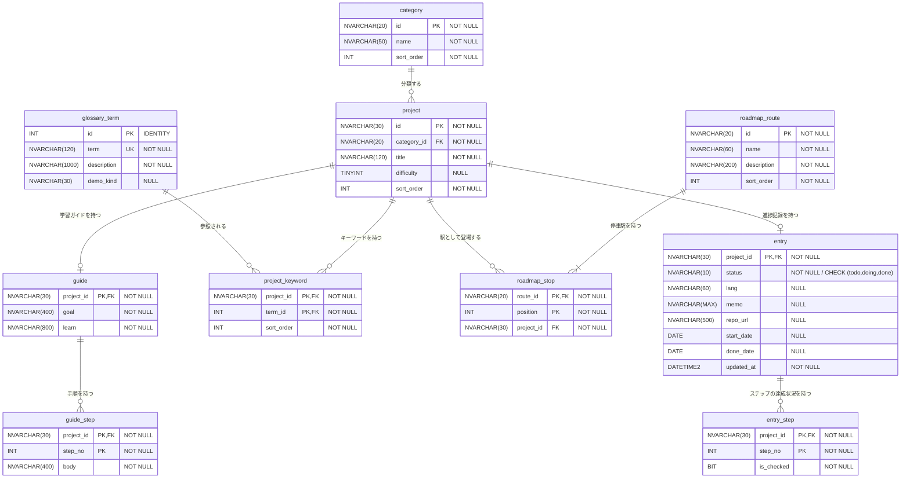

# DB環境の構築

## テーブルのスキーマ

- [車輪の再発明トラッカー - 移植設計](../../車輪の再発明トラッカー_移植設計.md)

### ER図



## SQL Serverで NULL 許容カラムを定義する

```SQL
CREATE TABLE Users (
    Id INT IDENTITY(1,1) PRIMARY KEY,
    Name NVARCHAR(50) NOT NULL,    -- NULLを許可しない（必須）
    Email NVARCHAR(100) NULL,      -- NULLを許可する
    Nickname NVARCHAR(50)          -- 何も書かない場合はNULLを許可
);
```

## SQL Serverで FOREIGN KEY を定義する

- [SQL Serverで学ぶFOREIGN KEY制約：外部キーでデータの整合性を確保する方法](https://beagle-dog.com/sql-server-foreign-key-guide/)

```SQL
CREATE TABLE Orders (
    OrderID INT PRIMARY KEY,
    OrderDate DATE NOT NULL,
    CustomerID INT,
    FOREIGN KEY (CustomerID) REFERENCES Customers(CustomerID) ON DELETE CASCADE
);
```

## SQL Serverで UNIQUE 制約を設ける

- [SQL ServerのUNIQUE制約とは？特定の列の値が重複しないようにする方法と設定手順](https://beagle-dog.com/sql-server-unique-constraint/)

```SQL
CREATE TABLE Users (
    user_id INT PRIMARY KEY,
    email NVARCHAR(255) UNIQUE,
    username NVARCHAR(50)
);
```

## SQL Serverで CHECK 制約を設ける

- [SQL ServerのCHECK制約を完全解説：データの整合性を保つ方法](https://beagle-dog.com/sql-server-check-constraints/)

```SQL
CREATE TABLE Customers (
    CustomerID INT PRIMARY KEY,
    Gender CHAR(1),
    CONSTRAINT CK_Gender CHECK (Gender IN ('M', 'F'))
);
```
