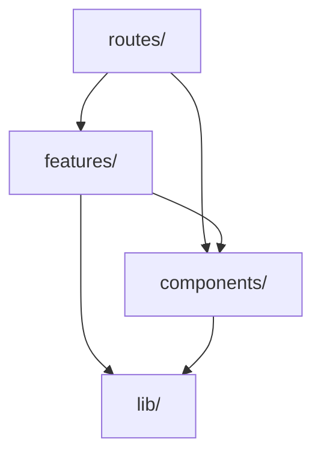
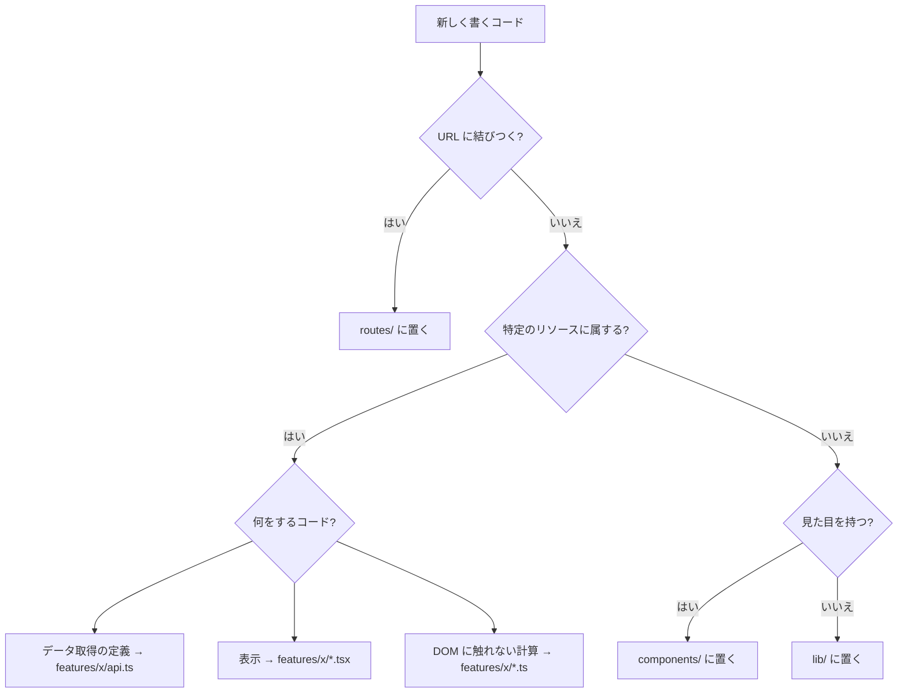
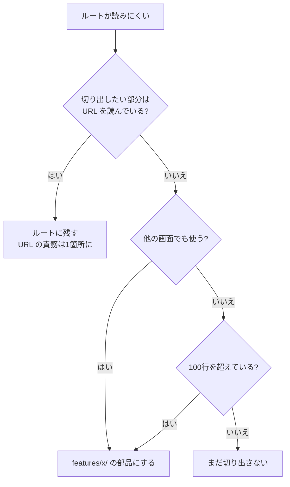

# フロントエンドアーキテクチャ

## Reactフォルダ構成 (`web/src/`)

- [Reactフォルダ構造の最適解。コンポーネントの数に合わせて選ぶ基本方針](https://levtech.jp/media/article/column/detail_711/)
- [【React】フォルダ構成の考え方](https://zenn.dev/bln/articles/986b709f4df0c1)

機能別でフォルダを作成し、その機能フォルダ内で技術的な分類をするのがいいかも

```PlainText
web/src/
├─ main.tsx
├─ routes/
│  ├─ router.tsx              ルート定義（1箇所に集約）
│  ├─ RootLayout.tsx          ヘッダ・ナビの枠
│  ├─ DashboardRoute.tsx
│  ├─ ProjectListRoute.tsx
│  ├─ ProjectDetailRoute.tsx
│  ├─ RoadmapRoute.tsx
│  └─ GlossaryRoute.tsx
├─ features/
│  ├─ projects/
│  │  ├─ api.ts               queryOptions と fetch
│  │  ├─ ProjectTable.tsx
│  │  └─ ProjectGuide.tsx
│  ├─ entries/
│  │  ├─ api.ts
│  │  ├─ EntryForm.tsx
│  │  ├─ StatusBadge.tsx
│  │  ├─ status.ts            純粋ロジック
│  │  └─ status.test.ts
│  ├─ glossary/
│  ├─ roadmap/
│  └─ progress/
├─ components/
│  ├─ ui/                     shadcn の生成物
│  └─ AppNav.tsx              アプリ固有の共通部品
├─ lib/
│  ├─ api/
│  │  ├─ schema.gen.ts        生成物
│  │  └─ client.ts            fetch ラッパ
│  ├─ queryClient.ts
│  └─ utils.ts                cn()
└─ demos/
   └─ lru/
      ├─ lru.ts
      ├─ lru.test.ts
      └─ LruDemo.tsx
```

## 依存の向き



検出方法:

```bash
grep -rn "@/features/" web/src/features/
```

## 新機能を実装するときの判断チャート

### 1. 書いたコードをどこに置くか



### 2. ルートが厚くなってきたとき



## ファイルの分類指針

| 置き場所 | 入れるもの | 入れないもの |
| --- | --- | --- |
| `routes/` | URL の読み書き、データ取得の起点、ローディング/エラー分岐、部品の配置 | 表示の詳細、テーブルの列定義、フォームの検証 |
| `features/x/api.ts` | `queryOptions`、`queryKey`、fetch 関数 | 表示、React のフック呼び出し |
| `features/x/*.tsx` | その機能の表示部品。props で受け取り、props で返す | `useSearchParams`、他機能の import |
| `features/x/*.ts` | DOM に触れない純粋な計算。テストの主対象 | React、fetch |
| `components/ui/` | shadcn の生成物。**自分で新規ファイルを置かない** | アプリ固有のもの |
| `components/` | 複数機能で使う自前の部品（ナビ、空状態表示など） | 特定機能でしか使わないもの |
| `lib/` | どの機能にも属さない道具。API クライアント、`cn()` | 表示を持つもの |
| `demos/` | 用語集のデモ。ドメインと無関係な独立部品 | 業務ロジック |

### 判定に迷ったときの問い

- **「この部品は projects を消しても残るか」** → 残るなら `components/`、消えるなら `features/`
- **「React を外しても意味があるか」** → あるなら `.ts`（純粋ロジック）、ないなら `.tsx`
- **「URL が変わったら振る舞いが変わるか」** → 変わるなら `routes/`

## 新しい画面を足す手順

1. **API 側を先に通す**

    `curl` でレスポンスを確認してから、フロントに取りかかる
2. **`npm run gen:api` で型を更新**

    生成された型から取り出す
3. **`features/x/api.ts` に `queryOptions` を足す**

    `queryKey` の階層は既存のものと揃える
4. **ルートを作り、`router.tsx` に登録**

    まずはデータが画面に出るところまで。見た目は後
5. **表示が育ったら features の部品に切り出す**

    切り出す基準は上のチャート
